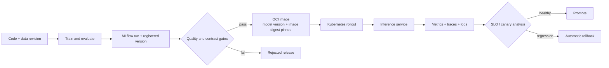

# ML Platform Lab

> **Portfolio status: active as of 2026-08-24.** The current deliverable is a
> **minimum operational surface** — probes, rollout, resource sizing and p95/p99 evidence by the
> shortest path through the phases below — not the full twelve-week Must. Nothing is deployed
> yet; the table under [Status](#status) is the executable state, and it changes only when a
> command works from a clean checkout.

[](pyproject.toml)
[](docs/development-plan.md)
[](docs/development-plan.md)

A production-like path from a trained model to an observable, recoverable Kubernetes
service. The model is deliberately small; the engineering result is the release system
around it.

> **Flagship question.** Can one reusable release path move a validated model from commit to
> an immutable Kubernetes deployment and reject or roll back bad releases before the measured
> service objective is exhausted?

This is not a catalogue of tools. MLflow, Kubernetes, Terraform, OpenTelemetry and the cloud
exist here only when they close a specific lifecycle or failure-mode gap. The result is a
release/recovery matrix with timings and immutable identifiers, not a screenshot of a green
dashboard.



## What must be demonstrated

| Claim | Required evidence |
|---|---|
| Reproducible lifecycle | commit, data fingerprint, MLflow run/model version and image digest are linked |
| Safe release | an incompatible or regressed candidate is rejected before full traffic |
| Reliable serving | probes, requests/limits, autoscaling and rollout behaviour are tested under declared load |
| Observable operation | p50/p95/p99, error rate, saturation and model version are queryable; one request is traceable |
| Recovery | repeated failure drills report detection and recovery timestamps, not just a successful final state |
| Reusable platform path | a second model workload uses the same contract and deployment template without copied pipeline logic |
| Reproducible cloud | Terraform can create, smoke-test and destroy the AWS environment without console steps |

The project will not claim a monthly production SLA from a short benchmark. It reports a
bounded load-test objective and exactly how long that observation lasted.

## Status

**Active at M1: the first workload trains reproducibly. Nothing is served or deployed yet.**
There is no HTTP service, container, Kubernetes cluster, cloud infrastructure, MLflow result,
latency number or reliability result in this repository today.

What does run, from a clean checkout:

| | |
|---|---|
| Workload | [`fraud_scoring`](services/fraud_scoring/README.md) — 284,807 card transactions, 492 fraudulent |
| Dataset identity | `content_hash` `0734105a…`, `schema_hash` `95534149…`, stable across download and cache |
| Training | deterministic — two runs produce a byte-identical artifact (`sha256 109c3ca7…`) |
| Baseline quality | average precision **0.801** on a time-ordered holdout (75 positives in 56,962 rows) |
| Release identity | commit + dataset fingerprint + artifact checksum, recorded per build |
| Tests | 52, offline, no download required |

The baseline is a training result, not an operational one. It says nothing yet about latency,
availability or recovery — those start at M2.

Work runs on the shortest path to a minimum operational surface (M1–M4 in the
[development plan](docs/development-plan.md#возврат-minimum-operational-surface)); phases 2 and
6–9 are deferred until that surface holds.

| Phase | Deliverable | State |
|---:|---|---|
| 0 | Architecture, learning contract, cost and reliability gates | scaffolded |
| 1 | Small workload, data/model contract, deterministic evaluation | **M1 done** — contract, deterministic training, release record |
| 2 | MLflow tracking, registry and lineage | not started — deferred past the surface |
| 3 | Immutable inference image and local service benchmark | not started — trimmed into M2 |
| 4 | Local Kubernetes deployment: probes, resources, HPA | not started — **M3, the core of the surface** |
| 5 | OpenTelemetry + Prometheus/Grafana and declared SLO | not started — RED slice is M4, rest deferred |
| 6 | Candidate rollout, automated analysis and rollback | not started — deferred past the surface |
| 7 | AWS infrastructure through Terraform and GitHub OIDC | not started — deferred past the surface |
| 8 | Second workload through the same golden path | not started — deferred past the surface |
| 9 | Clean-checkout reproduction and failure report | not started — deferred past the surface |

The twelve-week Must scope ends at phase 9. Kafka is a post-Must extension and opens only
with an actual asynchronous audit path, idempotent consumption, retries and a consumer-lag
drill. A producer and consumer with no failure contract do not count.

## Results

Empty until the [reliability protocol](docs/reliability-protocol.md) passes. Thresholds are
set before the first measured run and stay beside the load profile.

| Scenario | Candidate outcome | Availability | p95 / p99 | Detection time | Recovery time | Evidence |
|---|---|---:|---:|---:|---:|---|
| Healthy release | — | — | — | n/a | n/a | — |
| Schema-incompatible model | — | — | — | — | — | — |
| Crash-looping image | — | — | — | — | — | — |
| Latency regression | — | — | — | — | — | — |
| Registry unavailable during rollout | — | — | — | — | — | — |

No row is filled from a one-off manual demonstration. Raw load-generator output, Prometheus
queries, rollout events and immutable release identifiers are retained for every row.

## Scope boundaries

- One deliberately simple CPU model first; this is not a modelling competition.
- Local-first with Docker and `kind`; AWS is added only after the lifecycle and drills work
  locally.
- The deployed manifest pins an exact model version and image digest. An MLflow alias may
  select a candidate during promotion, but it is resolved before deployment.
- Native Kubernetes rollout behaviour is learned before adding rollout automation.
- No feature store, custom orchestrator, service mesh, multi-region design, GPU serving or
  distributed training in Must.
- No static AWS keys. CI authentication is short-lived and role-based.
- No cloud apply until spend limits, ownership tags and the destroy path are explicit.

## Planned layout

```text
services/           tiny training and inference workloads
mlplatform/         shared release identity, gates and deployment tooling
infra/              local Kubernetes and Terraform-owned AWS infrastructure
configs/            explicit platform decisions and preregistered thresholds
experiments/        release and recovery drills
reports/            reviewed results; raw run payloads stay untracked
tests/fixtures/      small incompatible and regressed release fixtures
docs/                architecture, plan, protocol, ADRs and learning tracks
```

Directories are intentionally populated only when their phase begins. Planned components are
not presented as implemented ones.

## Reproduce

```bash
make install   # sync the pinned environment
make check     # ruff + 52 tests, fully offline
make data      # download the source dataset once, canonicalise, write the fingerprint
make train     # deterministic fit; writes artifact, metrics and release record
```

`make data` fetches roughly 150 MB on first run and caches it under `data/raw/`; nothing else
touches the network. Training takes about five seconds on a laptop CPU.

Later phases add separate commands for local bootstrap, serving, deployment, drills and cloud
destruction. A command enters this section only after it works from a clean checkout.

## Documents

- [Development plan](docs/development-plan.md) — twelve-week Must path and stop conditions.
- [Architecture](docs/architecture.md) — planned boundaries, identifiers and failure model.
- [Reliability protocol](docs/reliability-protocol.md) — what a benchmark or recovery claim
  must contain.
- [Learning track](docs/learning-tracks/platform-engineering.md) — the order in which the
  underlying skills are learned.
- [Learning contract](LEARNING.md) — where AI assistance stops and author ownership begins.
