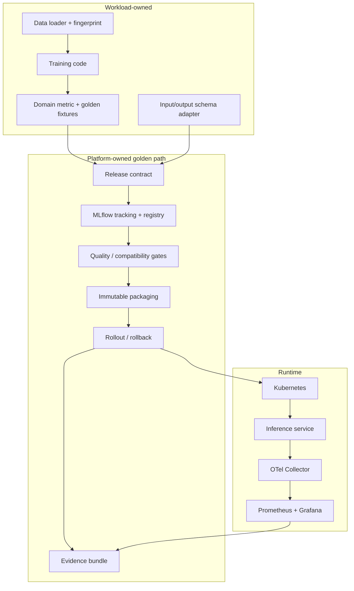

# Архитектура

Статус документа: **planned target, M1 checkpoint**. Компонент на схеме не считается реализованным, пока у
него нет команды запуска, test/drill и evidence path.

## Границы системы



Platform layer не знает, что означает target или business metric. Workload не решает, как
именуется release, как фиксируется image digest и как устроен rollout. Второй workload — тест
этой границы.

## Цепочка идентичности

Один deployable release должен образовывать замкнутую цепочку:

```text
source commit
  + data fingerprint
  + training config / seed
       -> MLflow run
       -> registered model name + exact version
       -> artifact checksum + model signature
       -> OCI image digest
       -> rendered deployment config digest
       -> Kubernetes rollout revision
       -> evidence bundle
```

Alias `candidate` или `champion` допустим как управляющий указатель в registry. Перед build или
deploy он разрешается в exact model version. Runtime manifest не зависит от того, куда alias
будет переведён позже.

## Владельцы состояния

| State | Source of truth | Что не является source of truth |
|---|---|---|
| source/config | Git commit | локальный изменённый файл |
| experiment lineage | MLflow run | имя notebook |
| model artifact | registry version + checksum | alias без version |
| container | OCI digest | mutable image tag |
| infrastructure | Terraform state | состояние после console edit |
| rollout | Kubernetes API events/status | последний шаг CI log |
| SLI history | Prometheus | Grafana screenshot |
| reviewed result | evidence bundle + report | устное «сработало» |

## Planned local topology

- MLflow tracking/registry с PostgreSQL backend;
- S3-compatible artifact store только для локальной parity;
- registry для OCI images;
- `kind` cluster для workload, rollout controller и telemetry stack;
- OpenTelemetry Collector как единая точка экспорта;
- Prometheus/Grafana для SLI и drills;
- внешний load generator, чтобы падение cluster не уничтожало клиента и timestamps.

SQLite и локальная директория artifacts подходят для самого первого smoke, но не для
reliability result: они скрывают отдельные dependency failure modes.

## Planned AWS topology

Минимальный cloud slice:

- EKS для runtime parity с локальным Kubernetes;
- ECR для immutable image digest;
- S3 для model artifacts и Terraform state;
- отдельный database-backed registry store;
- IAM roles с workload identity и GitHub OIDC;
- monitoring path, достаточный для тех же SLI и drills.

Конкретные database/network choices фиксируются ADR после local phase и cost estimate. До
этого они не замораживаются в диаграмме. Dev/prod config и state разделяются, но один account
не выдаётся за полноценную organisational isolation.

## Failure model

| Boundary | Failure | Expected safe behaviour | Evidence |
|---|---|---|---|
| training → registry | metric/schema gate fails | version rejected; no package | gate output + tags |
| registry → package | artifact missing/corrupt | build fails closed | checksum failure |
| package → rollout | image cannot start | healthy ReplicaSet retains traffic | events + ready replicas |
| pod → service | model not ready | endpoint removed from traffic | readiness + EndpointSlice |
| candidate → promotion | p95/error regression | promotion stops; previous digest restored | SLI window + rollout revision |
| runtime → registry | registry unavailable | pinned running release continues | successful requests during outage |
| app → telemetry | exporter unavailable | request policy remains explicit; telemetry loss alerts | app SLI + collector queue/drop metrics |
| CI → AWS | identity/policy denied | no partial manual workaround | OIDC/IAM event + failed plan/apply |
| Terraform → state | concurrent mutation | state lock rejects one writer | lock event |

Expected behaviour becomes a result only after the corresponding drill runs.

## Security and cost invariants

- no static AWS access key in GitHub or repository;
- default-deny IAM scope, then exact actions/resources/conditions required by the path;
- no secrets in Terraform values, plan artifacts, images or telemetry;
- state encryption, versioning and locking are enabled before main-stack apply;
- image and dependency scanning is a release gate, not a decorative report;
- cloud resources have owner and TTL metadata;
- budget and destroy verification precede the first measured cloud run;
- `terraform destroy` success is followed by a provider-side inventory/billing-resource check.

## Current reference decisions

- MLflow model aliases and tags are used instead of deprecated registry stages:
  <https://mlflow.org/docs/latest/ml/model-registry/workflow/>.
- Kubernetes startup/readiness/liveness have different semantics:
  <https://kubernetes.io/docs/concepts/workloads/pods/probes/>.
- HPA based on utilization requires resource requests:
  <https://kubernetes.io/docs/concepts/workloads/autoscaling/horizontal-pod-autoscale/>.
- Terraform S3 backend uses versioning and native lockfile-based state locking:
  <https://developer.hashicorp.com/terraform/language/backend/s3>.
- Python telemetry goes through OpenTelemetry APIs/SDK and instrumentation libraries:
  <https://opentelemetry.io/docs/languages/python/>.

Versions are pinned only when a component enters implementation; a phase-0 plan does not
pretend to be a tested compatibility matrix.
